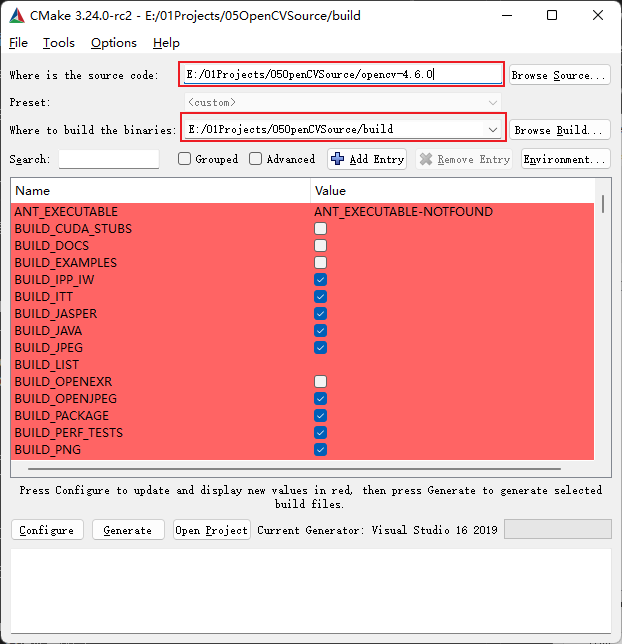
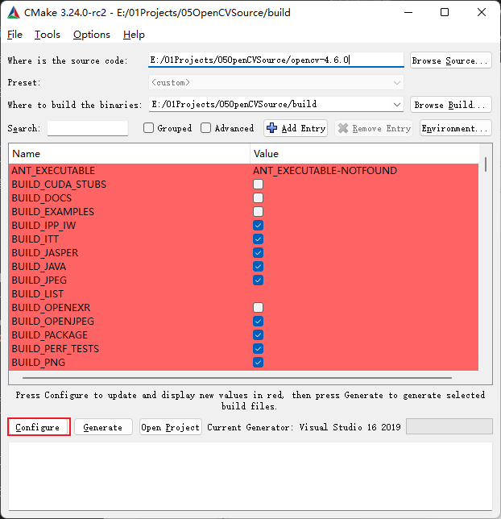
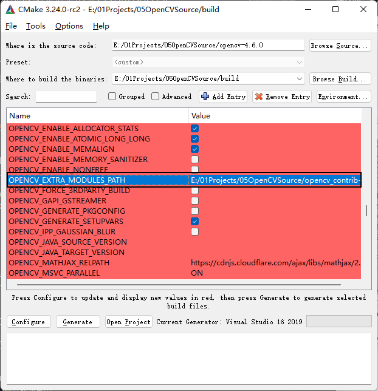
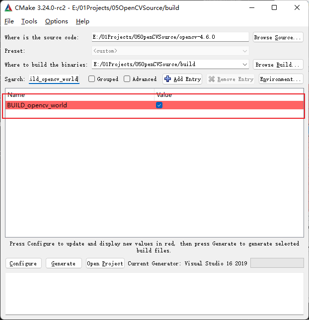
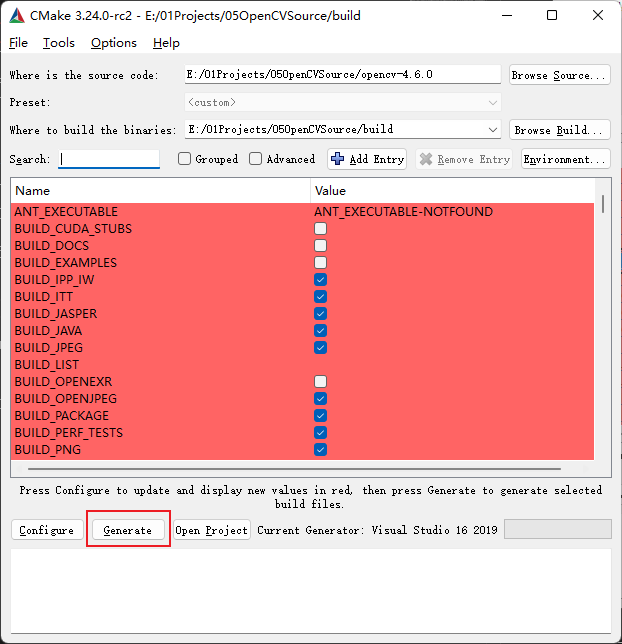

# OpenCV 学习记录

## 源码下载

OpenCV官网下载地址

CV核心库源码下载地址：https://github.com/opencv/opencv/archive/4.6.0.zip

CV_Contrib 源码下载地址：https://github.com/opencv/opencv_contrib/tags

先下载源码，然后将两个源码放在同级目录下，以方便我们在编译的时候可以将CV的Contrib库同时编译进去。

## Window 下使用CMake编译核心源码

打开CMake，选择源码位置，我存储CV源码的位置在E盘：E:/01Projects/05OpenCVSource/opencv-4.6.0；为了方便管理CMake的文件，我在源码的同级目录下创建了一个build文件夹，选择编译结果的存储位置：E:/01Projects/05OpenCVSource/build。

点击Configure，此时CMake弹出选择编译器，我系统上安装的是Visual Studio 2019，我就默认选择了Visual Studio 2019 进行编译。其他都采用默认参数。然后点击finish确定我们的选择。

此时，CMake正在根据OpenCV的配置文件进行自动的分析过程，过程中会下载一些必要的文件，需要在联网的情形下完成，然后等待分析完成。

然后我们将OPENCV_EXTRA_MODULES_PATH的值修改为我们存放CV_Contrib下的modules地址：E:/01Projects/05OpenCVSource/opencv_contrib-4.6.0/modules。配置该处的原因是我们要同时编译一些OPencv的额外模块，人脸识别的时候需要使用的face模块中的内容。

找到BUILD_opencv_world，点击启用。启用这个选项的作用是将opencv的模块都打包成一个动态库，这样我们就不需要一个一个去添加到项目中了。只需要添加一个opencv_world.lib就可以了。

再次点击configure，进行第二次的配置。

完成configure之后，我们点击generate按钮，生成visual studio 2019 的解决方案文件OpenCV.sln.

下面我们打开解决方案，找到项目管理中的install方案，右键弹出菜单，点击生成，在这里我们可以只生成一个release 64位版本即可。

编译完成之后，所有的库的头文件和动态链接库文件会拷贝到 build/install文件夹中。

